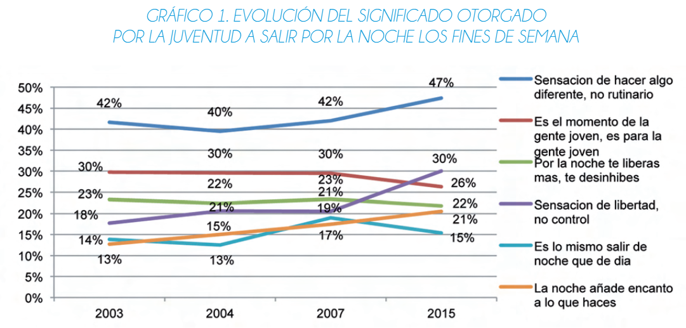
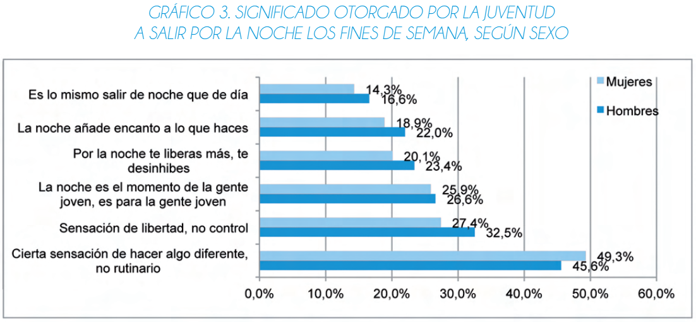
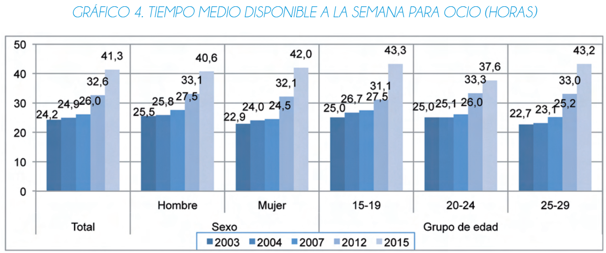

<h1>CAPÍTULO II: REQUISITOS DE ELICITACIÓN Y ANÁLISIS</h1>
<h2>2.1 Competidores</h2>

En el competitivo mercado de la venta de entradas para eventos en línea, MyEvent se enfrenta a varios competidores destacados. Entre ellos, se encuentran plataformas establecidas como Teleticket, Passline y Joinnus. Teleticket, reconocida por su amplia cobertura nacional, ofrece una amplia gama de eventos culturales y de entretenimiento. Por otro lado, Passline se destaca por su interfaz fácil de usar y su enfoque en la seguridad de las transacciones. Joinnus, por su parte, se distingue por su versatilidad, no solo como plataforma de venta de entradas, sino también como organizadora y promoción de eventos. Aunque estos competidores representan una competencia sólida, MyEvent busca diferenciarse mediante características únicas, como la opción de combos exclusivos, asociaciones conn establecimientos y opciones para revendedores, para ofrecer a los usuarios una experiencia completa y emocionante al comprar entradas para eventos locales.

<h3>2.1.1 Análisis competitivo</h3>
<table>
    <tr>
        <th>¿Por qué llevar a cabo este análisis?</th>
        <th colspan="4">El análisis competitivo es fundamental para comprender el entorno en el que opera nuestro proyecto. Nos permite identificar las fortalezas, debilidades, oportunidades y amenazas de nuestros competidores, lo que a su vez nos ayuda a tomar decisiones estratégicas informadas para mejorar nuestra posición en el mercado y desarrollar ventajas competitivas.</th>        
    </tr>
  <tr>
    <th></th>
    <th>MyEvent</th>
    <th>Teleticket</th>
    <th>Passline</th>
    <th>Joinnus</th>
  </tr>
  <tr>
    <td><strong>Overview</strong></td>
    <td>MyEvent es una plataforma de venta de entradas intuitiva para usuarios y organizadores de eventos, con una amplia variedad de eventos y un enfoque en la satisfacción del cliente.</td>
    <td>Teleticket es una plataforma líder en la venta de entradas para eventos en Perú. Ofrece una amplia gama de servicios relacionados con la venta de boletos para conciertos, obras de teatro, eventos deportivos y más.</td>
    <td>Passline es una plataforma de venta de entradas que se enfoca en la facilidad de uso y la integración con redes sociales. Ofrece una experiencia de compra rápida y sencilla para los usuarios.</td>
    <td>Joinnus es una plataforma de eventos que no solo se centra en la venta de entradas, sino que también proporciona información detallada sobre eventos culturales, deportivos y de entretenimiento en Perú.</td>
  </tr>
  <tr>
    <td><strong>Ventajas Competitivas</strong></td>
    <td>Destacamos por nuestra diversidad de eventos, funcionalidades completas de plataforma y modelo de negocio transparente.</td>
    <td>Gran experiencia en el mercado local, asociaciones sólidas con organizadores de eventos, diversidad de eventos disponibles.</td>
    <td>Facilidad de uso de la plataforma, integración con redes sociales, enfoque en la experiencia del usuario.</td>
    <td>Amplia variedad de eventos, información detallada y reseñas de eventos, comunidad activa de usuarios.</td>
  </tr>
  <tr>
    <td><strong>Mercado Objetivo</strong></td>
    <td>Nuestro mercado objetivo son usuarios interesados en una variedad de eventos y organizadores que buscan una plataforma sencilla para promocionar y vender boletos.</td>
    <td>Principalmente público local interesado en una amplia gama de eventos culturales y deportivos.</td>
    <td>Usuarios que buscan una experiencia de compra rápida y sencilla, con una inclinación hacia la tecnología y las redes sociales.</td>
    <td>Personas interesadas en descubrir nuevos eventos culturales, deportivos y de entretenimiento en Perú, con una mentalidad más exploratoria.</td>
  </tr>
  <tr>
    <td><strong>Estrategias de Marketing</strong></td>
    <td>Utilizamos estrategias de marketing digital, alianzas con organizadores locales y promociones especiales para aumentar la participación de los usuarios.</td>
    <td>Campañas publicitarias locales, colaboraciones con organizadores de eventos, promociones especiales.</td>
    <td>Marketing en redes sociales, promoción de la facilidad de uso, campañas de influencer marketing.</td>
    <td>Contenido en línea relevante, colaboraciones con artistas y organizadores de eventos, estrategias de SEO.</td>
  </tr>
  <tr>
    <td><strong>Productos & Servicios</strong></td>
    <td>Ofrecemos una plataforma de venta de entradas en línea con registro de usuarios, creación de eventos y venta de boletos para diversas actividades.</td>
    <td>Venta de entradas para una amplia gama de eventos, servicios de reserva de asientos, opciones de entrega de boletos.</td>
    <td>Venta de entradas en línea, reserva de boletos, integración con redes sociales para compartir eventos.</td>
    <td>Venta de entradas, información detallada sobre eventos, reseñas de usuarios, recomendaciones personalizadas.</td>
  </tr>
  <tr>
    <td><strong>Precios & Costos</strong></td>
    <td>Nuestros precios son transparentes y competitivos, con costos operativos que incluyen mantenimiento de plataforma y marketing.</td>
    <td>Nuestros precios son transparentes y competitivos, con costos operativos que incluyen mantenimiento de plataforma, marketing y soporte al cliente.</td>
    <td>Comisiones de servicio transparentes, posibles descuentos por compras a través de la plataforma.</td>
    <td>Comisiones de servicio competitivas, posibles ofertas y promociones para usuarios frecuentes.</td>
  </tr>
  <tr>
    <td><strong>Canales de Distribución</strong></td>
    <td>Distribuimos entradas a través de nuestra plataforma en línea, asociaciones con organizadores locales y puntos de venta físicos en lugares de eventos.</td>
    <td>Venta en línea a través del sitio web, puntos de venta físicos en locales asociados.</td>
    <td>Plataforma en línea accesible desde dispositivos móviles y computadoras, integración con redes sociales.</td>
    <td>Sitio web, aplicaciones móviles para iOS y Android, redes sociales, boletines informativos.</td>
  </tr>
  <tr>
    <td><strong>Fortalezas</strong></td>
    <td>Destacamos por nuestra diversidad de eventos, funcionalidades completas de plataforma y enfoque en la satisfacción del cliente.</td>
    <td>Reconocimiento de marca, experiencia en el mercado, asociaciones estratégicas.</td>
    <td>Facilidad de uso, integración con redes sociales, enfoque en la experiencia del usuario.</td>
    <td>Amplia variedad de eventos, información detallada, comunidad activa de usuarios.</td>
  </tr>
  <tr>
    <td><strong>Debilidades</strong></td>
    <td>Necesitamos aumentar el reconocimiento de marca y fortalecer nuestras asociaciones estratégicas.</td>
    <td>Puede carecer de innovación tecnológica, posible falta de enfoque en la experiencia del usuario.</td>
    <td>Puede ser percibido como menos establecido en comparación con competidores más antiguos, posibles limitaciones en la diversidad de eventos.</td>
    <td>Menos reconocimiento de marca en comparación con competidores establecidos, posibles dificultades para atraer a usuarios más tradicionales.</td>
  </tr>
  <tr>
    <td><strong>Oportunidades</strong></td>
    <td>Vemos oportunidades en la expansión a nuevos mercados, colaboraciones con organizadores emergentes y desarrollo de nuevas características para mejorar la experiencia del usuario.</td>
    <td>Expansión a nuevos mercados, innovación tecnológica, colaboraciones estratégicas.</td>
    <td>Crecimiento en la base de usuarios a través de campañas de marketing en redes sociales, expansión internacional.</td>
    <td>Desarrollo de nuevas características en la plataforma, asociaciones con organizadores de eventos emergentes.</td>
  </tr>
</table>

<h3>2.1.2 Estrategias y tácticas frente a competidores</h3>

Considerando el rubro de eventos y los competidores en el mercado, hemos delineado las siguientes estrategias clave:

<ol>
    <li><strong>Enfoque en la diversidad de eventos:</strong> Nos centraremos en ofrecer una amplia variedad de eventos para satisfacer los diferentes gustos e intereses de nuestro público objetivo. Esto nos diferenciará de competidores que pueden tener un catálogo más limitado de eventos.</li>
    <li><strong>Promoción de eventos exclusivos:</strong> Organizaremos y promocionaremos eventos exclusivos que no estén disponibles en otras plataformas. Esto atraerá a usuarios que buscan experiencias únicas y diferenciadas.</li>
    <li><strong>Optimización para dispositivos móviles:</strong> Nos aseguraremos de que nuestra plataforma sea completamente compatible y fácil de usar en dispositivos móviles, lo que permitirá a los usuarios comprar entradas sobre la marcha. Esta facilidad de acceso puede ser una ventaja sobre competidores que pueden no tener una experiencia móvil tan fluida.</li>
    <li><strong>Colaboraciones con organizadores de eventos locales:</strong> Estableceremos relaciones sólidas con organizadores de eventos locales para ofrecer promociones especiales y acceso exclusivo a nuestros usuarios. Esto nos ayudará a fortalecer nuestra presencia en la comunidad y atraer a más usuarios a nuestra plataforma.</li>
</ol>
    
<h2>2.2 Entrevistas</h2>
<h3>2.2.1 Diseño de entrevistas</h3>
<h5>Preguntas dirigidas al segmento Organizadores de Eventos:</h5>
<ol>
    <li>¿Qué desafíos enfrentas al promocionar y vender entradas para tus eventos actualmente?</li>
    <li>¿Cómo sueles gestionar la venta de entradas para tus eventos?</li>
    <li>¿Qué funcionalidades te gustaría ver en una plataforma de venta de entradas para facilitar la organización de tus eventos?</li>
    <li>¿Qué criterios consideras al elegir una plataforma para vender tus entradas?</li>
    <li>¿Qué tipo de soporte o asistencia esperarías de una plataforma de venta de entradas?</li>
    <li>¿Qué estrategias utilizas para atraer a un público más amplio a tus eventos?</li>
    <li>¿Qué tan importante es para ti tener acceso a datos y análisis sobre la venta de entradas y la asistencia a tus eventos?</li>
    <li>¿Alguna vez te ha pasado que has vendido todas las entradas para algún evento y a la hora del show no estaba lleno? y si pasó eso. ¿Cómo te sentiste?</li>
    <li>¿Cómo te sientes acerca de compartir información sobre tus eventos en una plataforma online?</li>
    <li>¿Qué medidas de seguridad y privacidad consideras esenciales al utilizar una plataforma de venta de entradas para tus eventos?</li>
</ol>

<h5>Preguntas dirigidas al segmento Compradores de Entradas:</h5>
<ol>
    <li>¿Con qué frecuencia asistes a eventos como conciertos, festivales o espectáculos en vivo?</li>
    <li>¿Qué te motiva a comprar entradas para un evento en particular?</li>
    <li>¿Qué aspectos consideras más importantes al elegir dónde comprar tus entradas?</li>
    <li>¿Has tenido alguna experiencia negativa al comprar entradas para eventos en el pasado?</li>
    <li>¿Qué funcionalidades te gustaría ver en una plataforma de venta de entradas para mejorar tu experiencia como comprador?</li>
    <li>¿Qué tan importante es para ti tener acceso a información detallada sobre los eventos y las entradas disponibles?</li>
    <li>¿Qué opinas sobre la posibilidad de obtener recompensas o descuentos por asistir a eventos de manera regular?</li>
    <li>¿Prefieres comprar tus entradas directamente del organizador del evento o a través de una plataforma de venta de entradas?</li>
    <li>¿Qué tan importante es para ti tener opciones de pago seguras y convenientes al comprar entradas para eventos?</li>
    <li>¿Qué medidas de seguridad y privacidad consideras esenciales al comprar entradas en línea?</li>
</ol>

<h3>2.2.2 Registro de entrevistas</h3>

<h3>Segmento Cliente</h3>
<h4>Nombre: Raúl Quispe Medina</h4>
<h4>Entrevistador: Luis Alejandro Zárate Gamarra</h4>

  
Detalles:

    <ul>
    <li>Género: Masculino</li>
    <li>Edad: 22 años</li>
    <li>Ubicación: San Miguel</li>
  </ul>

 

  <table style="border: 1px solid gray;">
    <tr>
        <td></td>
    </tr>
    <tr><td class="justificado">El entrevistado asiste a eventos como conciertos, festivales o espectáculos en vivo varias veces al mes, siendo motivado principalmente por la calidad de los artistas o el tipo de evento, así como por la ubicación y el ambiente del lugar. Valora la confiabilidad del servicio al elegir dónde comprar sus entradas, buscando plataformas conocidas y seguras debido a experiencias negativas previas. Desea ver en una plataforma de venta de entradas recomendaciones personalizadas, mapas de asientos detallados y opciones como saltar colas y participar en actividades interactivas. Considera crucial tener acceso a información detallada sobre los eventos y las entradas disponibles. Aprueba la posibilidad de obtener recompensas o descuentos por asistir a eventos regularmente y prefiere comprar entradas a través de una plataforma de venta de entradas debido a su conveniencia y capacidad para comparar precios. La seguridad y la conveniencia en las opciones de pago son fundamentales, así como medidas de seguridad y privacidad en línea, como la protección de datos personales y la autenticación de dos factores.
</td></tr>
    <tr><td>Link de la entrevista: <a href="https://youtu.be/r0Uu0f3oFPU">https://youtu.be/r0Uu0f3oFPU</a></td></tr>
  </table>

<h3>Segmento Organizador de evento</h3>
<h4>Nombre: Jordy Muñoz Salcedo</h4>
<h4>Entrevistador: Piero Jhoynner Muñoz Salcedo</h4>

  
Detalles:

    <ul>
    <li>Género: Masculino</li>
    <li>Edad: 24 años</li>
    <li>Ubicación: Cercado de Lima</li>
  </ul>

 

  <table style="border: 1px solid gray;">
    <tr>
        <td></td>
    </tr>
    <tr><td class="justificado">En la entrevista Jordy nos cuenta que uno de los problemas que tiene al organizar un evento es la fuerte competencia, y que las estrategias que utiliza si bien le funcionan, no logra captar el público que espera.Además comenta que considera viable utilizar una plataforma web que facilite la compra de entradas e incorpore medios de pago como visa, bcp y otros medios de pagos conocidos. También indica que quisiera confiabilidad y seguridad en las plataformas web para que sus asistentes puedan comprar sus entradas de manera segura. Indica que quisiera que esta plataforma cuente con un sistemas optimo para que recopile la informacion de pago, y un asesoramiento para manipular esa información. Comenta que unas de sus estrategias es contratar cantantes o  animadores que puedan crear una mejor experiencia a sus asistentes.Considera que los datos son importantes para estudiar el comportamiento del publico y la rentabilidad del evento. Comenta que no es tan común que la gente pague sus entrada y no asista al evento, y que la mayoria de personas llegan tarde a este. Comenta que si bien no trabaja con ninguna plataforma web de compra de entradas, el preferiría hacerlo con las mas conocidas como passline, entre otras.
</td></tr>
    <tr><td>Link de la entrevista: <a href="https://www.youtube.com/watch?v=iP0pR0_jSx0">https://www.youtube.com/watch?v=iP0pR0_jSx0</a></td></tr>
  </table>

<h4>Nombre: Joaquin Paredes Angeles</h4>
<h4>Entrevistador: Alessandro Joaquin Bernardo Eusebio</h4>

  
Detalles:

    <ul>
    <li>Género: Masculino</li>
    <li>Edad: 21 años</li>
    <li>Ubicación: Cercado de Lima</li>
  </ul>

 

  <table style="border: 1px solid gray;">
    <tr>
        <td></td>
    </tr>
    <tr><td class="justificado">En la entrevista Joaquin nos destaca los desafíos actuales en el mercado de eventos, como la saturación y la incertidumbre en la asistencia. Se prefiere el uso de servicios de venta de entradas en línea por su conveniencia, y se desean características como personalización, integración con redes sociales y herramientas analíticas en las plataformas de venta de entradas. Al elegir una plataforma, se considera la facilidad de uso, tarifas y seguridad. Se espera un soporte completo. Las estrategias de marketing incluyen publicidad digital y colaboraciones. Acceder a datos y análisis es crucial para evaluar el rendimiento. Aunque no ha ocurrido personalmente, se reconoce el impacto negativo de una baja asistencia en un evento vendido. Se considera esencial compartir información en línea sobre eventos, siempre que se respeten las medidas de seguridad y privacidad.</td></tr>
    <tr><td>Link de la entrevista: <a href="https://www.youtube.com/watch?v=OLU-1__nHN8">https://www.youtube.com/watch?v=OLU-1__nHN8</a></td></tr>
  </table>

<h3>Segmento Organizador de Eventos</h3>
<h4>Nombre: Jesús Espinoza</h4>
<h4>Entrevistador: Michael Stefano Carmelino Dueñas</h4>

  
Detalles:

    <ul>
    <li>Género: Masculino</li>
    <li>Edad: 19 años</li>
    <li>Ubicación: Pueblo Libre</li>
  </ul>

 

<table style="border: 1px solid gray;">
    <tr>
        <td></td>
    </tr>
    <tr><td class="justificado">En la entrevista Jesús nos cuenta sus dificultades que tiene cada vez que quiere realizar eventos, como conseguir gente que quiera ser promotora
de sus eventos y las publicaciones que debe realizar para cada uno de ellos para atraer a público, también encontrar al público objetivo 
aunque en la mayoría son jóvenes. Comenta que para eventos más grandes, prefiere buscar algo más genérico para atraer atención de todo
público. Se le hace importante tener acceso a la información de participantes de sus eventos, más que todo para saber los porcentajes y 
datos sobre como va el evento. Comenta que sus eventos siempre se llenan. Sin embargo, no suelen llegar a la hora establecida, y suelen llegar
en horas tardías, generando miedo e incertidumbre sobre si su evento se llenará o no.</td></tr>
    <tr><td>Link de la entrevista: <a href="https://youtu.be/kTtdDcBem4g">https://youtu.be/kTtdDcBem4g</a></td></tr>
  </table>

<h3>Segmento Cliente</h3>
<h4>Nombre: Marco Eduardo Colca Chipana</h4>
<h4>Entrevistador: Luis Alejandro Zárate Gamarra</h4>

  
Detalles:

    <ul>
    <li>Género: Masculino</li>
    <li>Edad: 23 años</li>
    <li>Ubicación: Lince</li>
  </ul>

 

<table style="border: 1px solid gray;">
    <tr>
        <td></td>
    </tr>
    <tr><td class="justificado">En la entrevista recabamos que Marco asiste a eventos como conciertos, festivales o espectáculos en vivo varias veces al mes. Su motivación principal para comprar entradas radica en la calidad de los artistas o el tipo de evento, junto con la consideración de la ubicación y el ambiente del lugar. Al elegir dónde comprar sus entradas, valora la confiabilidad del servicio, la facilidad de uso de la plataforma y la variedad de eventos disponibles. Aunque no ha tenido experiencias negativas en el pasado, reconoce la importancia de la seguridad y la transparencia en las transacciones en línea. Para mejorar su experiencia como comprador, le gustaría ver funcionalidades como recomendaciones personalizadas y mapas de asientos detallados. Considera esencial tener acceso a información detallada sobre los eventos y las entradas disponibles, y le parece atractiva la posibilidad de obtener recompensas o descuentos por asistir a eventos de manera regular. Prefiere comprar entradas a través de una plataforma de venta de entradas debido a su conveniencia y la posibilidad de comparar precios. Considera fundamental tener opciones de pago seguras y convenientes, así como medidas de seguridad y privacidad al comprar entradas en línea.</td></tr>
    <tr><td>Link de la entrevista: <a href="https://youtu.be/LGgSQhsjqQI?si=h8IUovq9bNTRS-5z">https://youtu.be/LGgSQhsjqQI?si=h8IUovq9bNTRS-5z</a></td></tr>
  </table>

  

<h3>Segmento Cliente</h3>
<h4>Nombre: Flavio Vásquez Dorothy</h4>
<h4>Entrevistador: Michael Stefano Carmelino Dueñas</h4>

  
Detalles:

    <ul>
    <li>Género: Masculino</li>
    <li>Edad: 19 años</li>
    <li>Ubicación: Cercado de Lima</li>
  </ul>

 

<table style="border: 1px solid gray;">
    <tr>
        <td></td>
    </tr>
    <tr><td class="justificado">En la entrevista vemos como Flavio es una persona que suele asistir a ventos recurrentemente, incluso, el próximo mes ira a un concierto. Comenta que antes a comprado entradas
    en otros lugares como facebook marketplace y que por suerte no a sufrido ninguna estafa. Prefiere comprar entradas y elije las más conocidas que hay en el país para ir a sus eventos. Y cree que lo mas
    importante para el sistema de seguridad es poder tener algún tipo de contraseña, ya que sí le gustaría que haya una app para eventos y que tenga buen método de pago.</td></tr>
    <tr><td>Link de la entrevista: <a href="https://youtu.be/n3ord5Jeg0c?si=u2xW-Qqrr0w6A7WW">https://youtu.be/n3ord5Jeg0c?si=u2xW-Qqrr0w6A7WW</a></td></tr>
  </table>

<h3>Segmento Cliente</h3>
<h4>Nombre: Lizbeth Estela Gamboa Cabrera</h4>
<h4>Entrevistador: Luis Mario Gonzales Anaya</h4>

  
Detalles:

    <ul>
    <li>Género: Femenino</li>
    <li>Edad: 20 años</li>
    <li>Ubicación: Los Olivos</li>
  </ul>

 

<table style="border: 1px solid gray;">
    <tr>
        <td></td>
    </tr>
    <tr><td class="justificado">Liz Gamboa no asiste con frecuencia a eventos como conciertos, festivales o espectáculos en vivo, pero tiene experiencia en la compra de entradas, siendo su motivación principal la conveniencia, especialmente cuando se trata de eventos virtuales para ahorrar costos como el pasaje y el tiempo. Valora la eficiencia del servicio al elegir dónde comprar sus entradas y ha tenido una experiencia negativa en el pasado con largas colas de espera en una página web. Le gustaría ver funcionalidades que mejoren la capacidad de personas en las colas de espera. Considera esencial tener acceso a información detallada sobre los eventos y las entradas disponibles, incluyendo detalles como el organizador, la fecha, el lugar y la ubicación de los asientos. La posibilidad de obtener recompensas o descuentos por asistir a eventos de manera regular le parece atractiva, especialmente si incluye descuentos en cadenas de comida. Prefiere comprar en plataformas de venta de entradas por su conveniencia y la posibilidad de comparar precios, pero le es muy importante tener opciones de pago seguras y convenientes, así como medidas de seguridad y privacidad robustas al comprar en línea, para evitar posibles fraudes o robos de datos.</td></tr>
    <tr><td>Link de la entrevista: <a href="https://youtu.be/VWth4gYwdHs">https://youtu.be/VWth4gYwdHs</a></td></tr>
  </table>

<h4>Nombre: Alvaro Calderon Cristobal</h4>
<h4>Entrevistador: Alessandro Joaquin Bernardo Eusebio</h4>

  
Detalles:

    <ul>
    <li>Género: Masculino</li>
    <li>Edad: 20 años</li>
    <li>Ubicación: Huancayo</li>
  </ul>

 

<table style="border: 1px solid gray;">
    <tr>
        <td></td>
    </tr>
    <tr><td class="justificado">El entrevistado compartió experiencias pasadas, incluyendo problemas técnicos durante el proceso de compra y la ocurrencia de cargos ocultos, lo que subraya la importancia de mejorar la transparencia y la funcionalidad en las plataformas de venta de entradas. Además, expresó el deseo de acceder a información detallada sobre eventos y opciones de entradas, así como la posibilidad de recibir recompensas por su fidelidad como cliente. La seguridad y la privacidad en línea también fueron aspectos cruciales, destacando la necesidad de medidas sólidas para proteger la información personal y financiera durante las transacciones en línea. En resumen, la entrevista proporcionó una comprensión exhaustiva de las expectativas y preocupaciones de un consumidor exigente en el mercado de eventos en vivo.</td></tr>
    <tr><td>Link de la entrevista: <a href="https://www.youtube.com/watch?v=n-AxQBOF04A&ab">https://www.youtube.com/watch?v=n-AxQBOF04A&ab</a></td></tr>
  </table>

  <h4>Nombre: Renato Nazario Begazo</h4>
<h4>Entrevistador: Piero Jhoynner Muñoz Salcedo</h4>

  
Detalles:

    <ul>
    <li>Género: Masculino</li>
    <li>Edad: 22 años</li>
    <li>Ubicación: Lima</li>
  </ul>

 

<table style="border: 1px solid gray;">
    <tr>
        <td></td>
    </tr>
    <tr><td class="justificado">En la entrevista renato nos comenta que frecuenta muchos eventos al mes, ya sea eventos universitarios, conciertos o dicotecas. El afirma que le motiva y le llama atención las ofertas o descuentos para adquirir sus entradas. Indica que a la hora de comprar quisiera que la plataforma de venta de entradas entradas sea seguro e integro. Comenta que el unico inconveniente que tiene con las compra de entradas en plataformas es la saturación de esta. Ademas, Le parecería factible que se pueda visualizar la disponibilidad de las entradas en tiempo real en la plataforma. Considera importante obtener información detallada e intuitiva en las plataformas de venta de entradas. Es muy importante para el considerar la seguridad de pago a la hora de ingresar sus datos, ademas, le gustaria que hayan diversos metodos de pago. Respecto a las medidas de seguridad, considera muy seguro el pago efectivo o paypal, ya que este metodo de pago evitaria compartir sus datos finacieros por paginas que no les genera total seguridad.</td></tr>
    <tr><td>Link de la entrevista: <a href="https://www.youtube.com/watch?v=6nz1Y9Z7brA">https://www.youtube.com/watch?v=6nz1Y9Z7brA</a></td></tr>
  </table>

<h3>2.2.3 Análisis de entrevistas</h3>

<h3>Organizador de Eventos:</h3>
    <ul>
        <li>Se destacan los desafíos actuales del mercado de eventos, como la saturación y la incertidumbre en la asistencia.</li>
        <li>Existe una preferencia por los servicios de venta de entradas en línea debido a su conveniencia.</li>
        <li>Se desean características como personalización, integración con redes sociales y herramientas analíticas en las plataformas de venta de entradas.</li>
        <li>Al elegir una plataforma, se considera la facilidad de uso, tarifas y seguridad como factores importantes.</li>
        <li>Estrategias de marketing incluyen publicidad digital y colaboraciones.</li>
        <li>Acceder a datos y análisis es crucial para evaluar el rendimiento de los eventos.</li>
        <li>Se reconoce el impacto negativo de una baja asistencia en un evento vendido.</li>
    </ul>
<h3>Cliente:</h3>
<ul>
        <li>Los clientes valoran la calidad de los artistas o el tipo de evento al comprar entradas.</li>
        <li>Se valora la confiabilidad del servicio, la facilidad de uso de la plataforma y la variedad de eventos disponibles al elegir dónde comprar entradas.</li>
        <li>Se considera importante la seguridad y la transparencia en las transacciones en línea.</li>
        <li>Mejoras deseadas incluyen recomendaciones personalizadas, mapas de asientos detallados y la posibilidad de obtener recompensas o descuentos por asistir a eventos de manera regular.</li>
        <li>Se prefiere comprar entradas a través de una plataforma de venta de entradas debido a su conveniencia y la posibilidad de comparar precios.</li>
        <li>Se destaca la importancia de opciones de pago seguras y convenientes, así como medidas de seguridad y privacidad al comprar entradas en línea.</li>
</ul>
<h3>Temas Destacados</h3>
  <ul>
        <li>Conveniencia de los servicios en línea</li>
        <li>Importancia de la seguridad en las transacciones</li>
        <li>Preferencia por características específicas en las plataformas de venta de entradas</li>
  </ul>

  <h3>Factores Importantes</h3>
  <ul>
        <li>Seguridad y confiabilidad del servicio</li>
        <li>Conveniencia de uso</li>
        <li>Variedad de eventos disponibles</li>
  </ul>

  <h3>Características Valoradas</h3>
  <ul>
        <li>Personalización e integración con redes sociales para organizadores de eventos</li>
        <li>Recomendaciones personalizadas y opciones de pago seguras para clientes</li>
  </ul>

En el análisis de las preferencias y expectativas de los jóvenes respecto a su ocio nocturno, es importante considerar los hallazgos de investigaciones como las realizadas por el Injuve y el Centro Reina Sofía sobre Adolescencia y Juventud. Estos estudios indican que, a lo largo de la última década, la sensación de ruptura con el tiempo ordinario ha sido el significado más destacado para la noche del fin de semana, identificado por casi la mitad de los jóvenes encuestados. Sin embargo, se observa un aumento en el número de jóvenes que consideran que salir de noche es similar a hacerlo durante el día, lo que podría indicar una transformación en las percepciones sobre el ocio nocturno. Según datos proporcionados, en 2003, un 13,8% estaba de acuerdo con esta afirmación, pasando en 2015 a un 15% (<em>Fuente: Elaboración propia a partir de datos del Injuve y del Centro Reina Sofía sobre Adolescencia y Juventud</em>).

Este cambio en las percepciones podría tener implicaciones significativas para la industria de eventos y venta de entradas, ya que afectaría las motivaciones de los jóvenes para asistir a eventos nocturnos. Además, los datos sugieren que la sensación de libertad ha ido ganando importancia en los últimos años, lo que podría reflejar una evolución en las expectativas y prioridades de los jóvenes en relación con su tiempo de ocio. Según los datos recabados, la sensación de libertad se situó como el segundo significado más relevante en 2015, con un 47% de los encuestados que la identificaron como importante (<em>Fuente: Elaboración propia a partir de datos del Centro Reina Sofía sobre Adolescencia y Juventud</em>).

En este contexto, es crucial considerar cómo estas tendencias pueden influir en la planificación y promoción de eventos, así como en el diseño de plataformas de venta de entradas. Por ejemplo, los organizadores de eventos podrían adaptar sus estrategias de marketing para destacar la sensación de libertad y la oportunidad de experimentar algo diferente durante la noche. Asimismo, las plataformas de venta de entradas podrían incorporar características que mejoren la personalización y la integración con redes sociales, lo que podría atraer a un público joven que valora la conexión digital y la expresión individual.

En resumen, comprender las expectativas cambiantes de los jóvenes respecto a su ocio nocturno es fundamental para adaptarse a las tendencias del mercado y satisfacer las necesidades de los clientes. Las investigaciones citadas proporcionan una base sólida para entender estas dinámicas y orientar las estrategias de negocio en la industria del entretenimiento y los eventos.

Estos puntos resaltan la importancia de garantizar la seguridad, ofrecer opciones de personalización y conveniencia, e integrar características sociales y analíticas en una plataforma de venta de entradas. Además, destacan la relevancia de considerar las preferencias cambiantes de los jóvenes en relación con su ocio nocturno, como lo sugieren los datos proporcionados por el Injuve y el Centro Reina Sofía sobre Adolescencia y Juventud.

  
  <h3>Análsis estadístico</h3>
  <ul>
        <li>A continuacion mostramos los principales problemas que nuestros entrevistados consideran en un servicio de venta de entradas:</li>
        
      
Descripcion: 

  </ul>

Estos puntos resaltan la importancia de garantizar la seguridad, ofrecer opciones de personalización y conveniencia, e integrar características sociales y analíticas en una plataforma de venta de entradas.

   
    
<h2>2.3 Needfinding</h2>
<h3>2.3.1 User Personas</h3>
<h3><strong>Ana García</strong></h3>

<h3><strong>Diego Martinez</strong></h3>

<h3>2.3.2 User Task Matrix</h3>

<h3>Ana García</h3>
<table>
  <tr>
    <td>Tarea del Usuario</td>
    <td>Descripción</td>
    <td>Frecuencia</td>
    <td>Intensidad</td>
    <td>Condición</td>
  </tr>
  <tr>
    <td>Comprar boletos para conciertos</td>
    <td>Adquirir boletos para eventos de sus artistas favoritos</td>
    <td>Variable</td>
    <td>Alta</td>
    <td>Cuando se anuncian conciertos de artistas favoritos / Cuando quiere asistir a eventos</td>
  </tr>
  <tr>
    <td>Descubrir nuevas bandas locales</td>
    <td>Investigar y descubrir bandas y artistas emergentes locales</td>
    <td>Semanal</td>
    <td>Moderada</td>
    <td>Cuando tiene tiempo libre</td>
  </tr>
  <tr>
    <td>Informarse sobre eventos</td>
    <td>Obtener información clara sobre la disponibilidad y precios</td>
    <td>Variable</td>
    <td>Moderada</td>
    <td>Antes de decidir asistir a un evento</td>
  </tr>
  <tr>
    <td>Encontrar métodos de compra más rápidos</td>
    <td>Buscar alternativas para una compra más ágil y rápida</td>
    <td>Variable</td>
    <td>Alta</td>
    <td>Cuando ha tenido problemas anteriores con la compra de boletos</td>
  </tr>
  <tr>
    <td>Asistir a conciertos favoritos</td>
    <td>Participar en eventos de sus artistas preferidos</td>
    <td>Variable</td>
    <td>Alta</td>
    <td>Cuando se llevan a cabo los conciertos / Cuando tiene tiempo disponible</td>
  </tr>
  <tr>
    <td>Explorar experiencias culturales</td>
    <td>Buscar nuevas experiencias culturales y eventos</td>
    <td>Mensual</td>
    <td>Baja</td>
    <td>Cuando está interesada en encontrar nuevas actividades culturales</td>
  </tr>
  <tr>
    <td>Socializar en eventos</td>
    <td>Interactuar con otros asistentes en los eventos</td>
    <td>Variable</td>
    <td>Moderada</td>
    <td>Durante los eventos</td>
  </tr>
</table>

<h3>Diego Martinez</h3>
<table>
  <tr>
    <td>Tarea del Usuario</td>
    <td>Descripción</td>
    <td>Frecuencia</td>
    <td>Intensidad</td>
    <td>Condición</td>
  </tr>
  <tr>
    <td>Coordinar la venta de boletos</td>
    <td>Organizar la venta de boletos para eventos, maximizando asistencia e ingresos</td>
    <td>Variable</td>
    <td>Alta</td>
    <td>Antes de cada evento</td>
  </tr>
  <tr>
    <td>Mejorar el proceso de compra</td>
    <td>Implementar mejoras en el proceso de compra de boletos para los clientes</td>
    <td>Semanal</td>
    <td>Alta</td>
    <td>Cuando se identifica una oportunidad de mejora</td>
  </tr>
  <tr>
    <td>Controlar la reventa de boletos</td>
    <td>Implementar estrategias para controlar la reventa y mantener precios justos</td>
    <td>Semanal</td>
    <td>Alta</td>
    <td>Antes y durante la venta de boletos</td>
  </tr>
  <tr>
    <td>Desarrollar herramientas de gestión</td>
    <td>Desarrollar y utilizar herramientas eficientes para gestionar la venta y distribución de boletos</td>
    <td>Semanal</td>
    <td>Alta</td>
    <td>Cuando se requiere mejorar la eficiencia en la gestión de boletos</td>
  </tr>
  <tr>
    <td>Diferenciarse en la industria</td>
    <td>Desarrollar estrategias para destacarse entre otros organizadores de eventos</td>
    <td>Variable</td>
    <td>Alta</td>
    <td>Antes de la planificación de eventos</td>
  </tr>
  <tr>
    <td>Analizar la competencia</td>
    <td>Realizar análisis de la competencia para identificar oportunidades y amenazas</td>
    <td>Semanal</td>
    <td>Alta</td>
    <td>Antes de la planificación de eventos</td>
  </tr>
  <tr>
    <td>Mejorar la experiencia del cliente</td>
    <td>Implementar medidas para mejorar la experiencia del cliente durante la compra de boletos</td>
    <td>Semanal</td>
    <td>Alta</td>
    <td>Cuando se identifican áreas de mejora en la experiencia del cliente</td>
  </tr>
</table>

<h3>2.3.3 User Journey Mapping</h3>
<h4>Journey Map - Cliente</h4>

<h4>Journey Map - Organizador de Eventos</h4>

<h3>2.3.4 Empathy Mapping</h3>
<h4>Empathy Map - Cliente</h4>

<h4>Empathy Map - Organizador de Eventos</h4>

<h3>2.3.5 As-Is Scenario Mapping</h3>
<h4>As-Is - Organizador de Eventos</h4>

<h4>As-Is - Cliente</h4>

<h2>2.3 Ubiquitous Language</h2>
<dl>
  <dt>Event Organizers</dt>
    <dd>Individuos o entidades responsables de planificar, promocionar y gestionar eventos, incluida la venta de entradas.</dd>
  <dt>Ticket Purchase</dt>
    <dd>El proceso de comprar boletos para eventos a través de una plataforma en línea o puntos de venta físicos.</dd>
  <dt>Ticket Sale</dt>
    <dd>El proceso de vender boletos para eventos a través de una plataforma en línea o puntos de venta físicos.</dd>
  <dt>User Registration</dt>
    <dd>El proceso mediante el cual los individuos crean cuentas en la plataforma de venta de entradas, proporcionando la información necesaria para comprar boletos.</dd>
  <dt>Event Discovery</dt>
    <dd>El proceso de encontrar y explorar varios eventos disponibles para asistir, a menudo facilitado por opciones de búsqueda y filtros.</dd>

  <dt>Secure Transactions</dt>
    <dd>Transacciones realizadas en la plataforma que están protegidas y encriptadas para garantizar la seguridad de la información financiera de los usuarios.</dd>
  <dt>Event Promotion</dt>
    <dd>Actividades realizadas para aumentar la conciencia e interés en eventos específicos, a menudo involucrando campañas de marketing y colaboraciones con organizadores.</dd>
  <dt>Ticket Authenticity</dt>
    <dd>Aseguramiento de que las entradas compradas a través de la plataforma son genuinas y válidas para ingresar al evento.</dd>
  <dt>Event Variety</dt>
    <dd>La diversidad de eventos disponibles para comprar en la plataforma, que atiende a diferentes interes</dd>
</dl>
    
