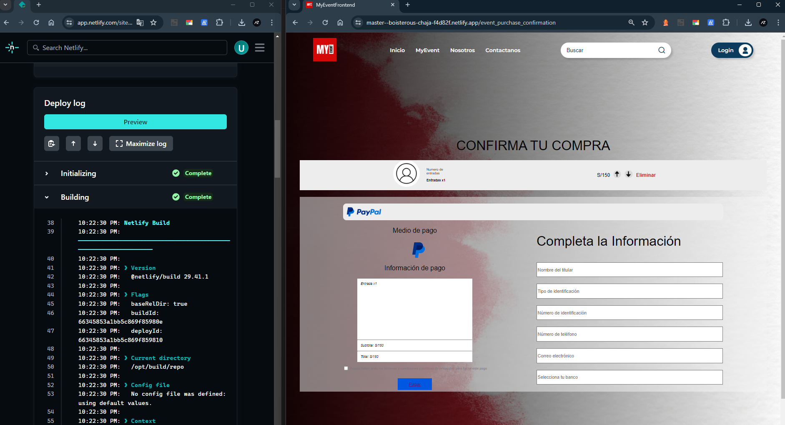
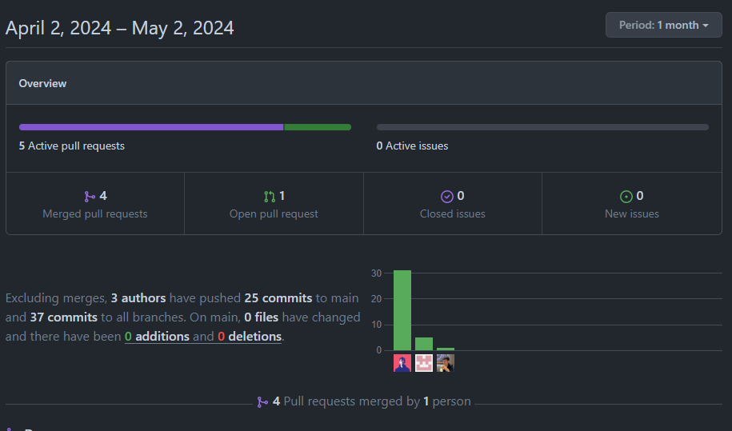
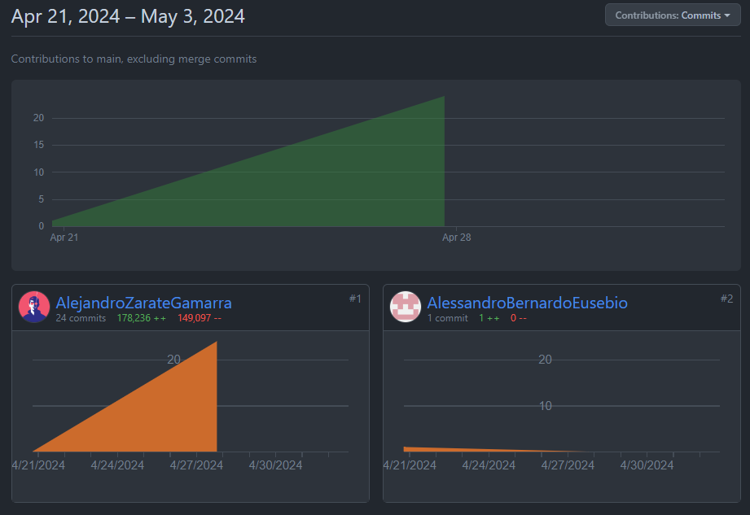

<h1>CAPÍTULO V: PRODUCT IMPLEMENTATION</h1>
<h2>5.1 Software Configuration Management</h2>
<h3>5.1.1 Software Development Environment Configuration</h3>

En la siguiente sección se detalla la ruta de acceso de cada uno de los productos de software, facilitando a cualquier miembro del equipo el desarrollo de cada aspecto del trabajo:

Visual Studio Code: Entorno de desarrollo.

HTML5: Lenguaje de marcado para la elaboración de páginas web.

CSS3: Tecnología para dar estilo a nuestras páginas web.

JavaScript: Lenguaje de programación orientado a objetos utilizado para implementar funcionalidades en nuestra Landing Page.

GitHub: Repositorio colaborativo en la nube.

GitHub Pages: Plataforma que facilita implementar despliegues sencillos para nuestras páginas web.

LucidChart: Aplicación web dedicada a la elaboración de Wireflows, User Flows y diagramas de clases.

Vertabelo: Plataforma colaborativa para la creación de diagramas de base de datos.

Figma: Herramienta colaborativa que permite elaborar wireframes y mockups.

<h3>5.1.2 Source Code Management</h3>

Link del Landing Page: https://stxfxno.github.io/MyEvent/myevent.html
    

Trabajamos con tres ramas principales:
  

Main: Es nuestra rama principal donde presentaremos nuestras publicaciones oficiales.

Dev: Esta rama es nuestro entorno de desarrollo, donde probamos e integramos las funcionalidades trabajadas antes de ser implementadas en la rama principal.
    

Feat: Esta rama se descompone en ramas individuales por cada funcionalidad o feature trabajada, permitiendo un enfoque más específico y organizado en el desarrollo de cada aspecto del proyecto.

<h3>5.1.3 Source Code Style Guide & Conventions</h3>

HTML:

En HTML se aplicó la nomenclatura en inglés, por ello en cada DIV su class va estar declarado en este idioma, también podemos observar esto en los inputs y en la clase de span.

div class="search">/div

div class="destination__container">/div

CSS:

En CSS se mantuvo el mismo trabajo de como se realizó en el HTML.
  

JS:

Con respecto al desarrollo del JS las variables usadas también se aplico la nomenclatura en inglés:

Con la primera función creada en JS de const showHideIcons se espera que cada vez que fuera a la izquierda o derecha se ocultara el icono de navegación:

Icono de la izquierda oculto:

Icono de la derecha oculto:

Con respecto a la segunda función, nos da la posibilidad de navegar en el carrusel de arrastrando las imágenes de manera horizontal, ya sea para la derecha o izquierda.

<h3>5.1.4 Software Deployment Configuration</h3>

Primero: Subimos todos los archivos necesarios para que github.pages funcione correctamente, entre ellos podemos observar el index.html, styles.css y las demás carpetas que están en formato html.

Segundo: Recordemos que para funcione la página correctamente la implementación de nuestro landing page debe de tener la siguiente nomenclatura:
  

Nombre del proyecto.github.io en este caso se uso el nombre de stxfxno para el nombre del proyecto.

Tercero: Verificamos que la pagina se haya subido de manera correcta a GitHub Pages , por ello entramos a settings y vamos al apartado de page. 

Una vez ya en Pages, asegurarnos que en Branch este seleccionado el de main y luego darle en save, esperamos unos minutos para que cargue la página.

Luego de esperar cierto tiempo, esperamos a que nuestra página este subida a GitHub Pages, si sale para visitar nuestro sitio web es porque lo hicimos correctamente.

<h2>5.2 Product Implementation & Deployment</h2>
<h3>5.2.1. Sprint 1
<h3>5.2.1.1 Sprint Planning 1</h3>
 <table>
            <thead>
                <tr>
                    <td>Sprint #</td>
                    <td>Sprint 1</td>
                </tr>
                <tr>
                    <td colspan="2">Sprint Planning Background</td>
                </tr>
            </thead>
            <tbody>
                <tr>
                    <td>Date</td>
                    <td>10/04/2024</td>
                </tr>
                <tr>
                    <td>Time</td>
                    <td>10:00 am</td>
                </tr>
                <tr>
                    <td>Location</td>
                    <td>Google Meet</td>
                </tr>
                <tr>
                    <td>Prepared By</td>
                    <td>Luis Alejandro Zárate Gamarra</td>
                </tr>
                <tr>
                    <td>Attendees (to planning meeting)</td>
                    <td>/ / Quispe Tipo, Godofredo / Luis Mario, Gonzales Anaya / Jeremi Jose, Antonio Fretel / Luis Alejandro, Zárate Gamarra //</td>
                </tr>
                <tr>
                    <td>Sprint n – 1 Review Summary</td>
                    <td>Debido a que es el primer sprint, no hay reviews de un sprint anterior.</td>
                </tr>
                <tr>
                    <td>Sprint n – 1 Retrospective Summary</td>
                    <td>Siendo el primer sprint, se mencionará la expectativa de los miembros del equipo: Terminar las actividades antes de la crítica. </td>
                </tr>
                <tr>
                    <td colspan="2">Sprint Goal & User Stories</td>
                </tr>
                <tr>
                    <td>Sprint 1 Goal</td>
                    <td>Diseñar e implementar una landing page, realizar el CRUD de adquisicion de boletos u entradas.</td>
                </tr>
                <tr>
                    <td>Sprint 1 Velocity</td>
                    <td>0</td>
                </tr>
                <tr>
                    <td>Sum of Story Points</td>
                    <td>13</td>
                </tr>
            </tbody>
        </table>

<h3>5.2.1.2 Sprint Backlog 1</h3>

En este primer Sprint Backlog el grupo se enfoco en realizar la landing page y el diseño del Front de la aplicación web junto con el CRUD de la venta de boletas. Para el registro de cada tarea utilizamos Trello

<table>
   <tr>
    <th>Sprint #</th>
    <th>Sprint 1</th>
  </tr>
   <tr>
    <th>User Story</th>
    <th></th>
    <th>Work-Item/Task</th>
  </tr>
  <tr>
    <th>Id</th>
    <th>Title</th>
    <th>Id</th>
    <th>Title </th>
    <th>Description</th>
    <th>Estimation(Hours)</th>
    <th>Assigned To</th>
    <th>Status (To-do / InProcess / ToReview / Done)</th>
  </tr>
  <tr>
    <th>US-01</th>
    <th>Visualizar una landing page intuitiva</th>
    <th>W-01</th>
    <th>Diseño </th>
    <th>Como visitante, quiero ver una landing page intuitiva, atractiva y sencilla para que pueda entender rápidamente el propósito del sitio web.</th>
    <th>2 hours</th>
    <th>Mario</th>
    <th>Done</th>
  </tr>
  <tr>
    <th>US-02</th>
    <th>Visualizar una sección de MyEvent</th>
    <th>W-02</th>
    <th>Sección quienes somos</th>
    <th>Como visitante, quiero ver una sección en el landing page que muestre los proximos eventos que auspicia la empresa.</th>
    <th>2 hours</th>
    <th>Luis</th>
    <th>Done</th>
  </tr>
  <tr>
    <th>US-03</th>
    <th>Visualizar una sección de Nosotros</th>
    <th>W-03</th>
    <th>Sección Nosotros</th>
    <th>Como visitante, quiero ver una seccion en el landing page que hable acerca de la empresa y su motivación.</th>
    <th>2 hours</th>
    <th>Jeremi</th>
    <th>Done</th>
  </tr>
  <tr>
    <th>US-04</th>
    <th>Visualizar una sección de contacto</th>
    <th>W-04</th>
    <th>Sección de contacto</th>
    <th>Como usuario, quiero una seccion donde pueda observar tarjetas de presentacion de personas con las cuales pueda comunicarme relacionadas con la empresa.</th>
    <th>3 hours</th>
    <th>Godofredo</th>
    <th>Done</th>
  </tr>
  <tr>
    <th>US-05</th>
    <th>Visualización de elementos Call to Action</th>
    <th>W-05</th>
    <th>Elementos call to action</th>
    <th>Como visitante, quiero poder observar dentro de la landing page algun elemento que pueda dirijirme directamente a la descarga o uso de la aplicacion que promueve esta landing page</th>
    <th>30 minutes</th>
    <th>Luis</th>
    <th>Done</th>
  </tr>
</table>

<h3>5.2.1.3 Development Evidence for Sprint Review</h4>
<table>
   <tr>
    <th>Repository</th>
    <th>Branch</th>
    <th>Commit ID</th>
    <th>Commit Message</th>
    <th>Commit ed on (Date)</th>
  </tr>
  <tr>
    <th>https://github.com/stxfxno/stxfxno.github.io </th>
    <th>main</th>
    <th>ed1a4aedcf00c8febefdd9616cb2422c7d7d3cb8</th>
    <th>"Archivos del landing page”</th>
    <th>Thu Apr 4 21:32:48 2024</th>
  </tr>
  <tr>
    <th>https://github.com/stxfxno/stxfxno.github.io</th>
    <th>main</th>
    <th>d7d8cdff3b4cf3f7351146fa01146efa0a45df8c</th>
    <th>"Seccion inicial”</th>
    <th>Sat Apr 6 00:42:24</th>
  </tr>
   <tr>
    <th>https://github.com/stxfxno/stxfxno.github.io</th>
    <th>main</th>
    <th>0f7c42fef72c8655ed7db2102ddd9d453cded3e1</th>
    <th>"Seccion MyEvent</th>
    <th>Sat Apr 6 00:42:24 2024</th>
  </tr>
  </tr>
   <tr>
    <th>https://github.com/stxfxno/stxfxno.github.io</th>
    <th>main</th>
    <th>ae044b664c4600f8be9812ac9821ad944ef6e5b5</th>
    <th>"Seccion Nosotros</th>
    <th>Thu Apr 4 21:32:48 2024</th>
  </tr>
  </tr>
   <tr>
    <th>https://github.com/stxfxno/stxfxno.github.io</th>
    <th>main</th>
    <th>7f4da2115b0aae7ff749db20cbed7486cddb06e4</th>
    <th>"Seccion Contacto</th>
    <th>Wed Apr 10 23:38:13 2024</th>
  </tr>
  </table>
<h3>5.2.1.4 Testing Suite Evidence for Sprint Review</h4>

Como nos encontramos en una etapa de diseño de la pagina web, aun no podemos realizar los respectivos Tests. Pero se están
realizando las validaciones para ir mejorando en nuetra pagina web

<h3>5.2.1.5 Execution Evidence for Sprint Review.</h3>

Registro de usuario:

Ingreso de usuario:

Ingreso de fecha de publicacion del evento:

Añadiendo evento:

Descripcion del Evento:

Registro de Evento Confirmado:

<h3>5.2.1.6 Services Documentation Evidence for Sprint Review.</h3>

Para este primer sprint no fue contemplada la evidencia de documentacion de los servicios.

<h3>5.2.1.7 Software Deployment Evidence for Sprint Review.</h3>

<h3>5.2.1.8 Team Collaboration Insights during Sprint.</h3>

<h3>5.2.2 Sprint 2</h3>
<h3>5.2.1.1 Sprint Planning 2</h3>
 <table>
            <thead>
                <tr>
                    <td>Sprint #</td>
                    <td>Sprint 2</td>
                </tr>
                <tr>
                    <td colspan="2">Sprint Planning Background</td>
                </tr>
            </thead>
            <tbody>
                <tr>
                    <td>Date</td>
                    <td>25/04/2024</td>
                </tr>
                <tr>
                    <td>Time</td>
                    <td>10:00 am</td>
                </tr>
                <tr>
                    <td>Location</td>
                    <td>Discord</td>
                </tr>
                <tr>
                    <td>Prepared By</td>
                    <td>Luis Alejandro Zárate Gamarra</td>
                </tr>
                <tr>
                    <td>Attendees (to planning meeting)</td>
                    <td>/ / Quispe Tipo, Godofredo / Luis Mario, Gonzales Anaya / Jeremi Jose, Antonio Fretel / Luis Alejandro, Zárate Gamarra //</td>
                </tr>
                <tr>
                    <td>Sprint n – 2 Review Summary</td>
                    <td>El primer sprint se centró en establecer la base para el diseño de la aplicación web y la implementación del CRUD de boletos. Se completaron todas las tareas asignadas, y se logró el objetivo del sprint, con todas las secciones de la landing page diseñadas e implementadas.</td>
                </tr>
                <tr>
                    <td>Sprint n – 2 Retrospective Summary</td>
                    <td>En retrospectiva del Sprint anterior, el equipo ha logrado un progreso significativo en el desarrollo de la landing page y el diseño del Front de la aplicación web, así como en la implementación del CRUD de la venta de entradas.</td>
                </tr>
                <tr>
                    <td colspan="2">Sprint Goal & User Stories</td>
                </tr>
                <tr>
                    <td>Sprint 2 Goal</td>
                    <td>Implementar el frontend, con varios componentes.</td>
                </tr>
                <tr>
                    <td>Sprint 2 Velocity</td>
                    <td>8</td>
                </tr>
                <tr>
                    <td>Sum of Story Points</td>
                    <td>12</td>
                </tr>
            </tbody>
        </table>

<h3>5.2.2.2 Sprint Backlog 2</h3>
<table>
    <tr>
     <th>Sprint #</th>
     <th>Sprint 2</th>
   </tr>
    <tr>
     <th>User Story</th>
     <th></th>
     <th>Work-Item/Task</th>
   </tr>
   <tr>
     <th>Id</th>
     <th>Title</th>
     <th>Id</th>
     <th>Title </th>
     <th>Description</th>
     <th>Estimation(Hours)</th>
     <th>Assigned To</th>
     <th>Status (To-do / InProcess / ToReview / Done)</th>
   </tr>
   <tr>
     <th>US-01</th>
     <th>Visualizar la vista de inicio de la aplicacion</th>
     <th>W-01</th>
     <th>Vista inicial de la aplicación </th>
     <th>Como usuario nuevo que accede a la aplicación por primera vez,
        Quiero poder ver la vista de inicio de la aplicación,
        Para poder familiarizarme con la interfaz y las opciones disponibles.
     <th>2 hours</th>
     <th>Luis</th>
     <th>Done</th>
   </tr>
   <tr>
     <th>US-02</th>
     <th>Visualizar la vista de inicio de sesion</th>
     <th>W-02</th>
     <th>Iniciar sesion</th>
     <th>Como usuario nuevo que desea utilizar el servicio,
       Quiero poder ver la opción de iniciar sesión en el sitio web o aplicación,
       Para acceder a todas las funcionalidades y personalizar mi experiencia según mis preferencias y necesidades.</th>
     <th>2 hours</th>
     <th>Godofredo</th>
     <th>Done</th>
   </tr>
   <tr>
     <th>US-03</th>
     <th>Visualizar la vista registro /th>
     <th>W-03</th>
     <th>Registro de usuario</th>
     <th>Como usuario nuevo interesado en utilizar la aplicación,
        Quiero poder ver la vista de registro de usuario,
        Para poder crear una cuenta y comenzar a utilizar todas las funcionalidades disponibles.
     <th>2 hours</th>
     <th>Godofredo</th>
     <th>Done</th>
   </tr>
   <tr>
     <th>US-04</th>
     <th>Visualizar el calendario de eventos futuros</th>
     <th>W-04</th>
     <th>Calendario de eventos</th>
     <th>Como usuario de la aplicación,
        Quiero poder acceder y visualizar el calendario de eventos futuros,
        Para poder planificar y organizarme con anticipación según las fechas y detalles de los eventos próximos.
     </th>
     <th>2 hours</th>
     <th>Luis</th>
     <th>Done</th>
   </tr>
   <tr>
     <th>US-05</th>
     <th>Visualizacion de la sección para añadir evento</th>
     <th>W-05</th>
     <th>Registrar un evento</th>
     <th>Como usuario de la aplicación,
        Quiero poder acceder y visualizar la sección para añadir evento,
        Para poder crear nuevos eventos y agregarlos al calendario con los detalles necesarios.
        <th>2 hours</th>
     <th>Mario</th>
     <th>Done</th>
   </tr>
   <tr>
     <th>US-06</th>
     <th>Visualización de la seccion del detalle del evento</th>
     <th>W-06</th>
     <th>Detalle de evento</th>
     <th>CComo usuario de la aplicación,
        Quiero poder acceder y visualizar la sección de detalle del evento,
        Para obtener información detallada sobre un evento específico, incluidos la fecha, la hora, la ubicación y cualquier otra información relevante.
    </th>
     <th>1 hours</th>
     <th>Jeremi</th>
     <th>Done</th>
   </tr>
 
   <tr>
     <th>US-07</th>
     <th>Visualización de la notificacion de transacción</th>
     <th>W-06</th>
     <th>Notificación de transacción</th>
     <th>Como usuario de la aplicación,
        Quiero poder recibir y visualizar notificaciones de transacciones,
        Para estar al tanto de las actualizaciones importantes relacionadas con mis actividades financieras, como pagos realizados, recibidos o cualquier otro tipo de transacción.
    </th>
     <th>1 hours</th>
     <th>Jeremi</th>
     <th>Done</th>
   </tr>
   <tr>
     <th>US-08</th>
     <th>Visualización de la confirmación de la compra del boleto</th>
     <th>W-06</th>
     <th>Confirmación de la compra del boleto</th>
     <th>Como usuario que realiza la compra de un boleto,
        Quiero poder ver la confirmación de la compra del boleto,
        Para asegurarme de que la transacción se haya completado con éxito y tener un registro de mi compra.
        <th>1 hours</th>
     <th>Jeremi</th>
     <th>Done</th>
   </tr>
 </table>
 <h3>5.2.2.3 Development Evidence for Sprint Review</h3>
<table>
    <tr>
        <td>Repository</td>
        <td>Branch</td>
        <td>Commit Id</td>
        <td>Commit Message</td>
        <td>Commit Message Body</td>
        <td>Commited on (Date)</td>
    </tr>
    <tr>
        <td>WS52-Open-Source-Grupo-2-MyEvent-Informe</td>
        <td>feature/notifications</td>
        <td>841ef6dd1515f226a07bb977ee8892adad260c96</td>
        <td>feat: Agregar vistas de notificacion de compra de entradas a eventos</td>
        <td>Agregar la vistas de notificaciones de compra de entradas a los eventos</td>
        <td>Commits on Apr 30, 2024</td>
    </tr>
    <tr>
        <td>WS52-Open-Source-Grupo-2-MyEvent-Informe</td>
        <td>feature/notifcaciones</td>
        <td>676f1701e3b29cfe15c7e1806aa1b7f5b769f702</td>
        <td>feat: Agregar creacion de eventos</td>
        <td>Creacion del componente de creacion de eventos hacia el fake API</td>
        <td>Commits on May 2, 2024</td>
    </tr>
    <tr>
        <td>WS51-App-Web-Grupo-2-MyEvent-Informe</td>
        <td>feature/create-event</td>
        <td>df92b59f91fc971fd669716f5d0096b6bad2457c</td>
        <td>feat: Se agregó el componente home</td>
        <td>Creación de componente home </td>
        <td>Commits on Apr 28, 2024</td>
    </tr>
        <tr>
        <td>WS51-App-Web-Grupo-2-MyEvent-Informe</td>
        <td>feature/loginregistercomplete</td>
        <td>80dd7fde062e88f54d4c9f13b9f86c18b0dd2819</td>
        <td>feat: se agregó funcionalidad al botón login e inicialización en el apartado del catálogo</td>
        <td>Creacion del boton de login e inicialización del apartado del catalogo</td>
        <td>Commits on May 1, 2024</td>
    </tr>
        <tr>
        <td>WS51-App-Web-Grupo-2-MyEvent-Informe</td>
        <td>feature/notification</td>
        <td>841ef6dd1515f226a07bb977ee8892adad260c96</td>
        <td>feat: Agregar vistas de notificacion de compra de entradas a eventos</td>
        <td>Creación de componente de notificacion de la compra del boleto</td>
        <td>Commits on Apr 30, 2024</td>
    </tr>
        <tr>
        <td>WS51-App-Web-Grupo-2-MyEvent-Informe</td>
        <td>feature/notification</td>
        <td>676f1701e3b29cfe15c7e1806aa1b7f5b769f702</td>
        <td>feat: Agregar creacion de eventos</td>
        <td>Merge de la creacion de eventos en la rama</td>
        <td>Commits on May 2, 2024</td>
    </tr>
</table>
<h3>5.2.2.4 Testing Suite Evidence for Sprint Review</h3>

  Dado que estamos en la fase de diseño del prototipo de la aplicación web, aún no es posible llevar a cabo pruebas exhaustivas. Sin embargo, estamos evaluando diversas herramientas y metodologías para garantizar que, una vez implementada, nuestra aplicación web sea robusta y libre de errores.

<h3>5.2.2.5 Software Deployment Evidence for Sprint Review</h3>

El proyecto se trabajo en un repositorio dentro de nuestra organización

Enlace al repositorio del proyecto: https://github.com/EVENTEC/WS52-Open-Source-Grupo-2-MyEvent-FrontEnd

El deployment de nuestro Front-end se ha desarrollado en Netlify

Enlace al proyecto desplegado: https://master--myevent-frontend-grupo2.netlify.app/ 

<h3>5.2.2.6 Services Documentation Evidence for Sprint Review</h3>
Debido a que estamos en la etapa de desarrollo del frontend de la aplicación web. No se está aplicando el servicio de Apis para la demostración de los datos, en su lugar se esta haciendo uso de una fake API.

<h3>5.2.2.7 Execution Evidence for Sprint Review</h3>

<h3>5.2.2.8 Team Collaboration Insights during Sprint</h3>

  Durante el Sprint actual, nos dispusimos a abordar las distintas mejoras para MyEvent. Empezamos con la creación de la plataforma principal en Angular. Para ello, dividimos las tareas para trabajar de manera eficiente y centrarnos en áreas específicas, con el fin de optimizar el tiempo y los recursos. Debido a esto, la participación de los miembros del equipo se ve reflejado en los commits realizados en el repositorio de trabajo:

<h1>CONCLUSIONES</h1>

Durante el desarrollo del front end para la aplicación de venta de entradas de eventos "MyEvent", se demostró un compromiso sólido con la implementación eficiente y efectiva de soluciones utilizando tecnología Angular. La elección de utilizar fake APIs a través de db.json para simular el comportamiento de las APIs reales fue una estrategia inteligente que permitió un desarrollo ágil y centrado en los requisitos del cliente. Esta decisión también facilitó la colaboración entre los desarrolladores al proporcionar un entorno controlado y predecible para probar y validar el front end.

El uso de Angular como framework de desarrollo web permitió la creación de una interfaz de usuario dinámica y receptiva, brindando a los usuarios una experiencia fluida al navegar por la aplicación y comprar entradas para eventos. Además, la implementación de fake APIs garantizó que el equipo de desarrollo pudiera trabajar de manera independiente en el front end sin depender de servicios externos, lo que aceleró el proceso de desarrollo y facilitó la iteración y mejora continua del producto.

En resumen, el proyecto de desarrollo del front end para la aplicación de venta de entradas de eventos "MyEvent" fue un éxito gracias a la combinación de tecnología Angular y la implementación inteligente de fake APIs. Esta experiencia no solo demostró la capacidad del equipo para adaptarse y aprovechar las herramientas disponibles de manera efectiva, sino que también sentó las bases para futuros proyectos de desarrollo web con un enfoque similar.

<h1>ANEXOS</h1>
<ul>
    <li>Marches Parra, J., & Granados Romero, A. (2022). Plataforma de compra y venta de entradas para eventos integrada en la tecnología blockchain. [Trabajo final de grado, Grau en Enginyeria Informàtica (Pla 2018), Escola Politècnica Superior d'Enginyeria de Vilanova i la Geltrú]. Universitat Politècnica de Catalunya. http://hdl.handle.net/2117/378090</li>
    <li>
        Lazcano Quintana, I., & Madariaga Ortuzar, A. (2016). El ocio nocturno de la juventud en España. En M.-A. Berthet, I. Lazcano Quintana, L. Lombi, A. Madariaga Ortuzar, A. Ramos Pérez, E. Rodríguez San Julián, A. Sanmartín Ortí, & S. J. Zoltán (Eds.), La marcha nocturna: ¿Un rito exclusivamente español? (pp. 34-95). ISBN 978-84-92454-33-4. https://dialnet.unirioja.es/descarga/articulo/6149003.pdf</li>
</ul>
